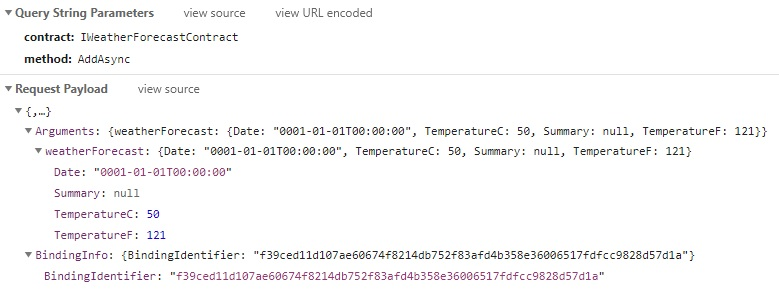
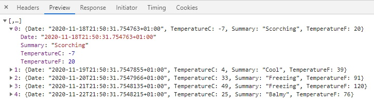

# Blazor Communication Foundation <!-- omit in toc -->

Blazor Communication Foundation is a simple library that provides communication between Blazor WebAsembly and ASP.NET Server using typed contracts defined through C# interfaces.

For a sample usage with authorization, you can refer to the [sample project](https://github.com/vrsekdev/vrsekdev-framework/tree/master/src/Blazor.BlazorCommunicationFoundation.Sample)

- [Installation](#installation)
- [Configuration](#configuration)
  - [Shared](#shared)
  - [Client](#client)
  - [Server](#server)
- [Usage](#usage)
- [Authorization](#authorization)
- [Advanced](#advanced)
  - [Custom serializer](#custom-serializer)
  - [Custom HttpClient](#custom-httpclient)
  - [Scopes](#scopes)
- [Debugging](#debugging)
  - [Request](#request)
  - [Response](#response)


## Installation

Into your client application, install package
```
Install-Package VrsekDev.Blazor.BlazorCommunicationFoundation.Client
```

Into your server application (ASP.NET Core hosted), install package
```
Install-Package VrsekDev.Blazor.BlazorCommunicationFoundation.Server
```

## Configuration

### Shared

First, you need to define contracts inside your `Shared` project. Contract is a C# interface that defines an API between client and server. Only methods that return Task are supported.

Sample contract
```csharp
using System;
using System.Collections.Generic;
using System.Text;
using System.Threading.Tasks;

namespace Blazor.BlazorCommunicationFoundation.Sample.Shared
{
    public interface IWeatherForecastContract
    {
        Task<WeatherForecast[]> GetAsync();

        Task<WeatherForecast[]> GetAsync(WeatherForecastGetFilter filter);

        Task AddAsync(WeatherForecast weatherForecast);
    }
}
```

### Client
Then you can add client configuration into client's Main method.
```csharp
using VrsekDev.Blazor.BlazorCommunicationFoundation.Client.DependencyInjection;
...

builder.Services.AddBCFClient(builder =>
{
    builder.Contracts.AddContract<IWeatherForecastContract>();
});

...
```

Also, you need to make sure that you registered HttpClient or that you are using custom implementation of `IHttpClientResolver` ([more](#custom-httpclient))

### Server
On server, you need to specify configuration for services. All extension methods for `IServiceCollection` can be used, including `AddTransient`, `AddScoped`, `AddSingleton` and implementation factories. 
```csharp
using VrsekDev.Blazor.BlazorCommunicationFoundation.Server.DependencyInjection;
...

services.AddBCFServer(builder =>
{
    builder.Contracts.AddTransient<IWeatherForecastContract, WeatherForecastService>();
});

...
```

Then add middleware after `UseAuthentication` and `UseAuthorization`
```csharp
using VrsekDev.Blazor.BlazorCommunicationFoundation.Server.Middlewares;
...

app.UseBlazorCommunicationFoundation();

...
```

## Usage

You can use DI on your client to resolve contracts and execute methods as you normally would.

Inside blazor components, you can use attribute `[Inject]`

```csharp
@inject IWeatherForecastContract WeatherForecastContract

@code {
    private WeatherForecast[] forecasts;

    protected override async Task OnInitializedAsync()
    {
        forecasts = await WeatherForecastContract.GetAsync();
    }
}
```

Or you can use it using constructor injection inside your client services registered in `ServiceProvider`

## Authorization

Refer to a page [Authorization](authorization.md)

## Advanced

### Custom serializer

Blazor Communication Foundation allows using different serializers for serializing data between client and server. By default, MessagePack is used, but JSON is also available.
To use JSON serializer, you need to install new package into your server and client application
```
Install-Package VrsekDev.Blazor.BlazorCommunicationFoundation.Serializers.Json
```

Into your server configuration, add this new line

```csharp
using VrsekDev.Blazor.BlazorCommunicationFoundation.Serializers.Json;
...

services.AddBCFServer(builder =>
{
    ...

    builder.UseSerializer<JsonInvocationSerializer>();
    
    ...
});
```

Into your client configuration, add this new line
```csharp
using VrsekDev.Blazor.BlazorCommunicationFoundation.Serializers.Json;
...

builder.Services.AddBCFClient(builder =>
{
    ...

    builder.UseSerializer<JsonInvocationSerializer>();

    ...
});
```

I recommend using it just for debugging by using `#if DEBUG` directive.

You can also provide custom serializer by implementing interface `IInvokeSerializer`

### Custom HttpClient

To use custom HttpClient to execute remote methods, you can use method `UseNamedHttpClient(string)` for using named HttpClients or `UseHttpClientResolver<TResolver>()` for custom implementations of interface `IHttpClientResolver`.

```csharp
builder.Services.AddHttpClient("WithAuth", client => client.BaseAddress = new Uri(builder.HostEnvironment.BaseAddress))
    .AddHttpMessageHandler(sp => sp.GetRequiredService<BlazorCommunicationFoundationHandler>());

builder.Services.AddBCFClient(builder =>
{
    builder.UseNamedHttpClient("WithAuth");
    // IWeatherForecastContract will use HttpClient registered by name "WithAuth"
    builder.Contracts.AddContract<IWeatherForecastContract>();
});
```

By default, instance of `HttpClient` will be obtained from IServiceProvider by type `HttpClient`.

```csharp
builder.Services.AddHttpClient("NoAuth", client => client.BaseAddress = new Uri(builder.HostEnvironment.BaseAddress));

// Register type HttpClient by instances supplied from factory
builder.Services.AddScoped(sp => sp.GetRequiredService<IHttpClientFactory>().CreateClient("NoAuth"));

builder.Services.AddBCFClient(builder =>
{
    // IWeatherForecastContract will use HttpClient registered from factory
    builder.Contracts.AddContract<IWeatherForecastContract>();
});
```

### Scopes

You can create scopes for contracts that enable you to combine multiple types of `IHttpClientResolver`. All contracts registered inside the scope will have the defined `HttpClient`.
```csharp
builder.Services.AddHttpClient("WithAuth", client => client.BaseAddress = new Uri(builder.HostEnvironment.BaseAddress))
    .AddHttpMessageHandler(sp => sp.GetRequiredService<BlazorCommunicationFoundationHandler>());

builder.Services.AddHttpClient("NoAuth", 
    client => client.BaseAddress = new Uri(builder.HostEnvironment.BaseAddress));

// Register type HttpClient by instances supplied from factory
builder.Services.AddScoped(
    sp => sp.GetRequiredService<IHttpClientFactory>().CreateClient("NoAuth"));

builder.Services.AddBCFClient(builder =>
{
    builder.CreateScope(scope =>
    {
        scope.UseNamedHttpClient("WithAuth");
        // IUserActionContract will use HttpClient registered by name "WithAuth"
        scope.Contracts.AddContract<IUserActionContract>();
    });
    // IWeatherForecastContract will use HttpClient registered from factory
    builder.Contracts.AddContract<IWeatherForecastContract>();
});
```

## Debugging

By default, Blazor Communication Foundation uses MessagePack to serialize communication between client and server, which is not human-readable.

To have an insight into the communication, I recommend using JSON serializer for `DEBUG` using `#if` directive. See [Custom serializer](#custom-serializer).

### Request
Request contains binding information with binding identifier and value of the arguments.


### Response
Response contains only serialized values by the selected serializer.
